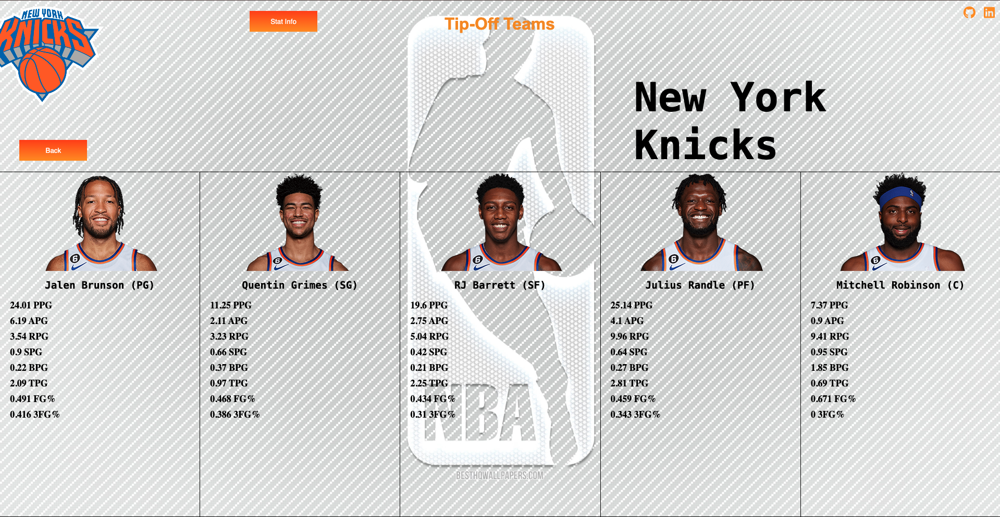
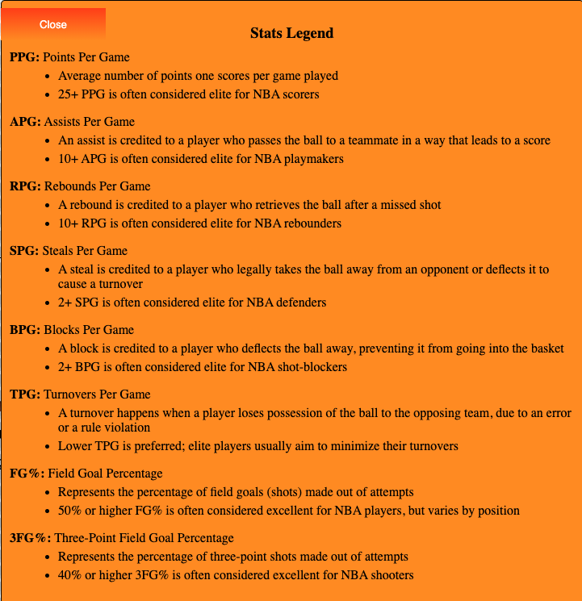

# Tip-Off Teams: NBA Team Lineups Visualizer
## Live Link
[Live Link](https://tip-off-teams.onrender.com)

## Overview
Tip-Off Teams is a dynamic web application designed to showcase the 2023-2024 NBA team starting lineups in an interactive and visually engaging format. The app allows users to select any NBA team and view detailed statistics of each starter, leveraging real-time data from the Ball Don't Lie API.

## Features
- **Interactive Team Selection:** Users can browse and select from a grid of NBA team logos.
- **Detailed Player Stats:** Upon selecting a team, users view the starting lineup with individual player statistics.
- **Clean Transitions:** Enjoyable user interface with smooth transitions between teams, implemented using Vanilla JavaScript.
- **Statistical Legend:** A guide to understanding the statistics presented in the application.
- **Navigational Ease:** Users can effortlessly return to the main logo grid to explore other teams.

## How to Use
1. **Select a Team:** Click on an NBA team logo from the main screen.
2. **Explore the Lineup:** View the starting lineup and statistics for the selected team.
3. **Learn More:** Click on the 'Stats Info' button for details on what each statistic means.
4. **Navigate:** Use the 'Back' button to return to the main screen and explore other teams.

## Technology Stack
- **Frontend:** JavaScript, HTML, CSS
- **APIs:** Ball Don't Lie API for real-time NBA data

## WireFrames:
[Intro Page](https://wireframe.cc/8bFHom)

[Individual Team Page](https://wireframe.cc/aLuUbU)

## Screenshots

### Team Selection Screen

This shows the Team Selection Screen where users can select any NBA logo they want to view that team's starting lineup.

### Team Stat Screen

This shows the starters of the team selected and stats of those starters. These stats are loade dform the balldontlie API.

### Stat Legend

This shows the stat legend that users can select to see what stats mean.

## Code Snippits
```javascript
//This function handles the API
async function fetchPlayerData(playerID){

    //FIRST, checks to see if the player ID is a rookie, if they are, then we go into rookieSim.js
    //and get that rookies stats (my own made json)
    const rookie = Object.values(rookies).find(rookie => rookie.playerDetails.id === playerID);

    if(rookie) {
        return Promise.resolve({
            player: rookie.playerDetails,
            stats: rookie.playerStats
        });
    }
//-------------------------------------------------------------------------------------------------

    //IF not a rookie: 
    //Establishes the URLs for both general info and playerStats
    // const apiUrl = process.env.NODE_ENV === 'production' ? '/playerInfo' : 'http://localhost:8000/playerInfo'; //For local testing
    // const statsURL = process.env.NODE_ENV === 'production' ? '/playerStats' : 'http://localhost:8000/playerStats' //For local testing
    const apiUrl = "https://tip-off-teams.onrender.com/playerInfo"; //for online
    const statsURL = "https://tip-off-teams.onrender.com/playerStats"; //for online
    //Gets general info (name, height, position, team, etc.)
    const fetchInfo = await fetch(apiUrl, {
        headers: {
            playerId: playerID
        }
    }).then(response => {
        if (!response.ok) {
            console.log(response);
            throw new Error('Error fetching player information');
        }
        return response.json();
    });

    //Gets stats (points, rebounds, assits, etc.)
    const fetchStats = await fetch(statsURL, {
        headers: {
           playerId: playerID
        }
    }).then(response => {
        if (!response.ok){
            throw new Error('Error fetching player stats');
        }
        return response.json();
    });

    //Nifty function that will put general info and stats into one key value hash (player for general info, stats for stats info)
    return Promise.all([fetchInfo, fetchStats]).then(results => {
        const [infoData, statsData] = results;
        return {
            player: infoData,
            stats: statsData.data[0]
        };
    })
    .catch(error => {
        console.error("There was an error fetching player data:", error.message);
        throw error;
    })
}
```
This code is the code that gets the information from the balldontlie API. Lets go through this code: 
- Step 1: Rookies at the time of making this were not in the balldontlie API. To work around this, I made a POJO for each rookie and there college stats. If a players ID is in line with a rookies ID, then we take the stats from that POJO and not balldontlieAPI.
- Step 2: We will then send that playersID as a header to the api call with the function fetchInfo, this will get that players info (name, non-stat information) and the same is true for the next function: fetchStats, which will get that players stats
- Step 3: Then we combine this information into one key value hash which we will use to easily display this information

## Credits and Acknowledgments
- **Data Sources:** Ball Don't Lie API, NBA.com for player headshots
- [Ball Don't Lie API](https://www.balldontlie.io/home.html#introduction)
- [NBA.com](https://www.nba.com/)

## Conclusion
Tip-Off Teams merges data visualization with sports analytics to create a unique user experience for NBA fans and data enthusiasts alike. This project exemplifies modern web development practices and showcases the power of interactive web applications.
